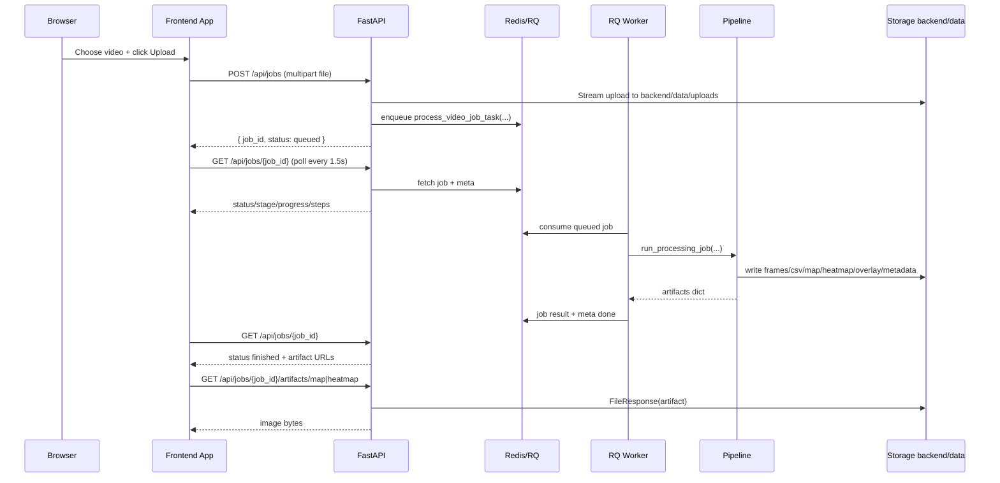
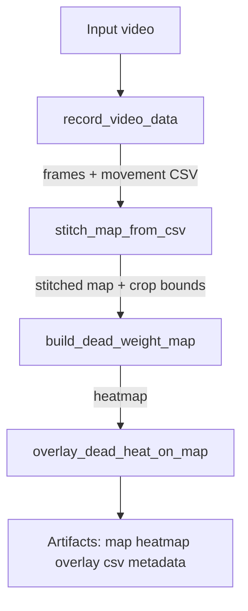

# Detect Motion Solution - Detailed Technical Documentation

## 1) Purpose and Scope

This document describes the complete implementation of the Detect Motion web solution, including:

- system architecture and service responsibilities
- exact request/queue/worker execution flow
- image processing pipeline internals
- frontend runtime behavior and state transitions
- artifact generation and storage layout
- dependency inventory (backend/frontend/runtime)
- operational behavior in Docker and local script mode
- known design decisions and extension points

This is intentionally implementation-level documentation meant for maintenance, debugging, and future refactoring.

---

## 2) High-Level Architecture

The solution is a containerized asynchronous processing system with four runtime components:

1. **Frontend** (`React + Vite`, port `5173`)  
   Uploads a video, polls job state, visualizes output layers.
2. **API** (`FastAPI + Uvicorn`, port `8000`)  
   Accepts uploads, creates RQ jobs, returns status and artifacts.
3. **Queue + Broker** (`Redis`, port `6379`)  
   Stores queued jobs and job metadata.
4. **Worker** (`RQ worker`)  
   Executes the processing pipeline and writes artifacts.

## 2.1 Component Diagram

```mermaid
flowchart LR
    U[User Browser] -->|POST /api/jobs + file| FE[Frontend - React]
    FE -->|HTTP| API[FastAPI API]
    API -->|enqueue job| RQ[RQ Queue]
    RQ -->|Redis commands| REDIS[(Redis)]
    W[Worker - rq worker detect-motion] -->|consume jobs| RQ
    W -->|read/write| FS[(backend/data)]
    API -->|serve artifact files| FE
    FE -->|poll /api/jobs/{id}| API
```

---

## 3) Repository Structure (Logical)

- `frontend/` - web UI
  - `src/App.tsx` - upload, polling, status UI, result display
  - `src/components/LayerViewer.tsx` - pan/zoom and layered image rendering
  - `src/api/client.ts` - API client functions and type contracts
- `backend/` - API and worker code
  - `app/main.py` - FastAPI endpoints
  - `app/queue.py` - Redis + queue binding
  - `app/tasks.py` - lightweight RQ task entrypoint (lazy import)
  - `app/jobs.py` - worker job function + step/progress metadata
  - `app/services/pipeline.py` - orchestration wrapper around processing core
  - `app/schemas.py` - response schemas
- `detect_movementv3.py` - primary processing pipeline implementation
- `image_preprocessing.py` - dead-tree mask generation logic
- `docker-compose.yml` - multi-service runtime
- `run_all.ps1` - local multi-process startup helper

---

## 4) Runtime Modes

## 4.1 Docker Mode (Primary)

Defined in `docker-compose.yml`:

- `redis` (`redis:7`)
- `api` (built from `backend/Dockerfile`)
- `worker` (same image, command `rq worker detect-motion`)
- `frontend` (built from `frontend/Dockerfile`, Vite dev server)

Shared persistent path:

- Host `./backend/data` mounted into containers at `/app/backend/data`

This enables:

- API writing uploads/jobs
- Worker reading uploads/writing artifacts
- API serving generated artifacts from the same mounted files

## 4.2 Local Script Mode

`run_all.ps1`:

- optionally ensures Redis container exists/runs
- installs backend/frontend dependencies
- starts API, worker, frontend in separate PowerShell windows

---

## 5) End-to-End Request and Processing Flow

## 5.1 Sequence Diagram



---

## 6) API Layer (FastAPI) Details

File: `backend/app/main.py`

## 6.1 Core Responsibilities

- initialize storage roots (`uploads`, `jobs`)
- expose job lifecycle endpoints
- sanitize and stream-upload input video
- enqueue processing task in RQ
- translate RQ job state/meta/result into API response schema
- serve generated artifacts as files

## 6.2 Endpoints

### `GET /api/health`

Returns:

```json
{ "ok": true }
```

### `POST /api/jobs`

Input:

- multipart `file`
- optional form params:
  - `show_video` (bool)
  - `save_interval_seconds` (int)
  - `save_interval_seconds_headless` (int)
  - `dead_overlay_opacity` (float)

Behavior:

1. Generates UUID job id.
2. Sanitizes filename via `_safe_filename()`.
3. Streams upload to disk via `_write_upload_file()` (1 MB chunks).
4. Enqueues `process_video_job_task` with arguments.
5. Returns `{ job_id, status: "queued" }`.

### `GET /api/jobs/{job_id}`

Behavior:

- fetches job by id from Redis
- returns transformed state with:
  - `status`
  - `stage`
  - `stage_detail`
  - `progress`
  - `steps`
  - `error`
  - `artifacts` (URL map when result exists)

### `GET /api/jobs/{job_id}/artifacts/{name}`

Valid names:

- `map`, `heatmap`, `overlay`, `csv`, `metadata`

Behavior:

- `409` if artifacts not ready
- `404` if missing/unknown
- streams file using `FileResponse`

## 6.3 Upload Hardening

Recent reliability/security hardening implemented:

- no full in-memory file read for uploads
- safe filename character filtering
- fallback filename if missing/invalid

---

## 7) Queue and Worker Layer

## 7.1 Redis + Queue Binding

File: `backend/app/queue.py`

- `REDIS_URL` from env (default `redis://localhost:6379/0`)
- queue name from `RQ_QUEUE_NAME` (default `detect-motion`)
- helper functions:
  - `get_redis()`
  - `get_queue()`

## 7.2 Lightweight Task Entrypoint

File: `backend/app/tasks.py`

Purpose:

- avoid importing heavy processing stack during API startup
- import worker job lazily only when job executes

Function:

- `process_video_job_task(...)` -> lazy-imports `app.jobs.process_video_job` and forwards call

## 7.3 Worker Job Function and Progress Model

File: `backend/app/jobs.py`

Function:

- `process_video_job(...)`

Responsibilities:

- deserialize options into `PipelineOptions`
- update RQ `job.meta` with stage/progress/detail
- maintain deterministic step state list:
  - `pending`
  - `running`
  - `done`
  - `failed`
- invoke pipeline orchestration
- on exceptions, persist failure metadata (`error`, failed step state)

Step labels exposed to frontend:

1. Prepare input
2. Extract frames + detect motion
3. Stitch map
4. Generate dead-tree mask heatmap
5. Render overlay
6. Finalize outputs

---

## 8) Processing Orchestration Layer

File: `backend/app/services/pipeline.py`

Function:

- `run_processing_job(job_id, input_video_path, output_dir, options, stage_callback)`

Responsibilities:

1. Copy source video into job directory (stable path).
2. Emit progress checkpoints (`mark(...)`) with detail messages.
3. Register event callback (`on_pipeline_stage`) passed into core pipeline.
4. Build metadata file (`metadata.json`).
5. Verify required artifacts exist before success.
6. Return canonical artifact mapping.

## 8.1 Artifact Existence Enforcement

`required_files` is validated before completion:

- map image
- heatmap image
- overlay image
- movement CSV
- metadata JSON

If any missing -> raises `FileNotFoundError`, job transitions to failed.

---

## 9) Core CV Pipeline

Primary file: `detect_movementv3.py`  
Auxiliary file: `image_preprocessing.py`

## 9.1 Core Pipeline Entry

`run_pipeline(...)` orchestrates:

1. path/config setup (`configure_pipeline_paths`)
2. frame extraction + motion recording (`record_video_data`)
3. map stitching (`stitch_map_from_csv`)
4. dead-tree weighted heatmap accumulation (`build_dead_weight_map`)
5. overlay rendering (`overlay_dead_heat_on_map`)

It emits stage events through `stage_callback`:

- `extract_and_detect_start/done`
- `stitch_map_start/done`
- `generate_dead_mask_start/done`
- `overlay_render_start/done`

## 9.2 Pipeline Stage Diagram



## 9.3 Stage A: Frame Extraction and Motion Logging

Function: `record_video_data()`

Detailed behavior:

- opens video with `cv2.VideoCapture`
- validates stream is open and first frame readable (hard fail if not)
- computes FPS (fallback `30.0` when invalid)
- derives frame-save cadence from `save_interval_seconds`
- computes sparse optical flow (`cv2.calcOpticalFlowPyrLK`)
- accumulates displacement (`dx`, `dy`) between save intervals
- writes:
  - sampled frames to `frames_<video_name>/frame_<id>.jpg`
  - movement CSV rows with direction/velocity totals

CSV columns:

- `frame_id`
- `prev_frame_id`
- `movement`
- `avg_velocity_px_s`
- `dx_total`
- `dy_total`

## 9.4 Stage B: Stitch Map from Motion CSV

Function: `stitch_map_from_csv()`

Detailed behavior:

- creates large black canvas (`8000 x 8000`)
- replays per-frame `dx_total`, `dy_total` to update placement origin
- blits each saved frame into computed coordinates
- thresholds non-black pixels and finds global bounding rect
- writes cropped map image
- returns crop bounds `(x, y, w, h)` for downstream heatmap alignment

## 9.5 Stage C: Dead-Tree Weighted Heatmap

Function: `build_dead_weight_map(crop_bounds)`

Detailed behavior:

- replays same coordinate trajectory as stitch stage
- for each frame, computes weighted dead mask via `image_preprocessing.compute_weighted_dead_mask`
- projects each mask onto dead canvas
- combines via per-pixel max accumulation
- crops to stitch bounds and writes heatmap image

## 9.6 Stage D: Overlay Rendering

Function: `overlay_dead_heat_on_map(...)`

Detailed behavior:

- loads stitched map
- normalizes heat to `0..1`
- creates per-pixel alpha = `opacity * heat`
- blends base map and tint color (BGR default red)
- writes overlay image

## 9.7 Failure Guardrails in Core Pipeline

The pipeline now raises explicit errors when required outputs are absent:

- missing CSV after extraction
- missing stitched map
- missing heatmap
- unreadable stitched map for overlay
- missing overlay file after render

This prevents false-positive "finished" states.

---

## 10) Dead-Tree Detection Internals (`image_preprocessing.py`)

The module combines multiple cues at low resolution (`32x32`) and upscales result:

1. **M1** threshold contour cue (weight currently `0.0`)
2. **M2** texture + saturation cue (weight `0.55`)
3. **M3** dead-color foliage cue in HSV + ExG logic (weight `0.45`)
4. **M4** edge density cue (weight currently `0.0`)

Weighted sum -> clipped mask -> optional contour/box processing for visualization helpers.

Key exported function used by worker pipeline:

- `compute_weighted_dead_mask(image_bgr)`

This returns a full-resolution grayscale heat map (`0..255`) used during accumulation.

---

## 11) Frontend Runtime Behavior

Primary files:

- `frontend/src/App.tsx`
- `frontend/src/api/client.ts`
- `frontend/src/components/LayerViewer.tsx`

## 11.1 API Client Layer

`client.ts` defines:

- `createJob(file)` -> `POST /api/jobs`
- `getJobStatus(jobId)` -> `GET /api/jobs/{id}`
- `artifactUrl(jobId, name)` -> deterministic artifact URL

Type contracts:

- `JobStatus` includes `status`, `stage`, `stage_detail`, `progress`, `steps`, `error`
- `JobStep` includes `key`, `label`, `state`

## 11.2 App State Machine

`App.tsx` state:

- upload file selection
- `jobId`
- polled `status`
- local heartbeat timestamps (`jobStartedAt`, `lastPolledAt`)
- layer mode (`none | map | heatmap | both`)

Polling:

- interval: `1500ms`
- starts after job creation
- stops on terminal statuses:
  - `finished`
  - `failed`
  - `stopped`
  - `canceled`
  - `cancelled`

UI behavior:

- pending jobs show processing panel with:
  - stage text
  - stage detail
  - step checklist
  - elapsed time
  - backend heartbeat age
  - real/indeterminate progress bar
- results viewer renders only on `finished`

## 11.3 Layer Viewer (Pan/Zoom)

`LayerViewer.tsx`:

- supports map layer and heatmap layer composition
- wheel zoom on cursor-over-viewer
- drag-to-pan behavior
- reset/zoom controls

Important UX hardening:

- wheel listener registered with `{ passive: false }`
- prevents page scroll while pointer is over viewer
- `overscroll-behavior: contain` in CSS to avoid scroll chaining

---

## 12) Job Status and Metadata Contract

Returned by `GET /api/jobs/{job_id}`:

- `job_id`: UUID
- `status`: queue status string
- `stage`: coarse stage name (e.g., `processing`, `done`, `failed`)
- `stage_detail`: human-readable active detail
- `progress`: `0.0..1.0`
- `steps`: ordered list of step objects (`key`, `label`, `state`)
- `error`: exception message when failed
- `artifacts`: URL map when complete
- `meta`: raw copied RQ metadata map

This contract is intentionally redundant (`stage`, `stage_detail`, `steps`, `meta`) to support both simple and advanced UIs.

---

## 13) Artifact Model and Filesystem Layout

Root runtime data directory:

- `backend/data/`

Subdirectories:

- `uploads/` - raw uploaded videos with prefix `<job_id>_`
- `jobs/<job_id>/` - all job outputs

Per-job artifacts:

- `frames_<video_name>/...` (sampled frames)
- `movement_data_<video_name>.csv`
- `stitched_map_<video_name>.jpg`
- `dead_heatmap_<video_name>.png`
- `stitched_map_dead_overlay_<video_name>.jpg`
- `metadata.json`

API artifact endpoint names:

- `map`
- `heatmap`
- `overlay`
- `csv`
- `metadata`

---

## 14) Dependency Inventory

## 14.1 Backend Python Packages (`backend/requirements.txt`)

- `fastapi` - API framework
- `uvicorn[standard]` - ASGI server
- `python-multipart` - multipart upload parsing
- `redis` - Redis client
- `rq` - job queue worker framework
- `opencv-python` - CV processing
- `numpy` - numeric processing
- `matplotlib` - imported by preprocessing module

## 14.2 Frontend Packages (`frontend/package.json`)

Runtime:

- `react`
- `react-dom`

Build/dev:

- `vite`
- `typescript`
- `@vitejs/plugin-react`
- `@types/react`
- `@types/react-dom`

## 14.3 Container Runtime Dependencies

Backend image (`backend/Dockerfile`) installs:

- `libgl1`
- `libglib2.0-0`

These are required by OpenCV runtime in containerized environments.

---

## 15) Docker Build and Runtime Configuration

## 15.1 Backend Image

Key build details:

- base image: `python:3.11-slim`
- `PYTHONPATH=/app:/app/backend`
  - allows importing root modules (`detect_movementv3.py`, `image_preprocessing.py`)
  - allows importing backend package (`app.*`)

## 15.2 Worker Command

Worker service runs:

- `rq worker detect-motion`

Important:

- avoids invalid invocation `python -m rq ...`
- uses queue name aligned with `RQ_QUEUE_NAME`

## 15.3 Service Coupling

- `frontend` depends on `api`
- `api` and `worker` depend on `redis`
- `api` and `worker` share `backend/data` volume

---

## 16) Error Handling Strategy

## 16.1 API-Level

- unknown job -> `404`
- artifact requested before completion -> `409`
- unknown artifact name -> `404`
- missing artifact file -> `404`

## 16.2 Worker-Level

- exceptions in processing propagate to RQ failure
- `jobs.py` writes:
  - `stage = failed`
  - `error = <exception text>`
  - current step marked `failed`

## 16.3 Pipeline-Level

- strict file existence checks before success
- explicit runtime errors for unreadable input/outputs

---

## 17) Call Graph (Who Calls What)

```mermaid
flowchart TD
    A[Frontend App.tsx onSubmit] --> B[createJob in client.ts]
    B --> C[POST /api/jobs in app/main.py]
    C --> D[queue.enqueue process_video_job_task]
    D --> E[app/tasks.py process_video_job_task]
    E --> F[app/jobs.py process_video_job]
    F --> G[run_processing_job in services/pipeline.py]
    G --> H[detect_movementv3.run_pipeline]
    H --> I[record_video_data]
    H --> J[stitch_map_from_csv]
    H --> K[build_dead_weight_map]
    K --> L[image_preprocessing.compute_weighted_dead_mask]
    H --> M[overlay_dead_heat_on_map]
    G --> N[return artifacts dict]
    N --> O[GET /api/jobs/{id}]
    O --> P[Frontend polling + UI update]
    P --> Q[LayerViewer loads map/heatmap artifacts]
```

---

## 18) Performance and Operational Notes

- The heaviest operation is frame extraction + optical flow over full video.
- Stitching and heatmap accumulation use large in-memory canvases (`8000x8000`), which increases RAM usage.
- Status/progress is event-based and coarse-grained, not frame-by-frame percentage.
- Frontend polling every `1.5s` is a deliberate tradeoff for responsive UX with low backend overhead.
- Upload streaming reduces memory spikes for large files.

---

## 19) Security and Robustness Notes

Implemented hardening:

- upload filename sanitization
- chunked upload write
- strict output existence verification
- lazy task import to avoid API startup failures from worker-only deps
- comprehensive terminal-state handling in frontend polling logic

Potential future hardening (not currently implemented):

- upload size limits and content-type validation
- auth / authorization on job endpoints
- per-job ownership and multi-user isolation
- retention policy for old artifacts

---

## 20) Extensibility Guide

## 20.1 Adding a New Processing Step

1. Add step key/label in `STEP_LABELS` (`backend/app/jobs.py`).
2. Emit stage events in `detect_movementv3.run_pipeline`.
3. Map events to progress/detail in `services/pipeline.py:on_pipeline_stage`.
4. Ensure output artifacts are validated and exposed if needed.

## 20.2 Adding a New Artifact

1. Produce file in pipeline.
2. Add to `artifacts` map in `services/pipeline.py`.
3. Add artifact name to `ARTIFACT_NAMES` in `main.py`.
4. Add frontend URL usage if visualized.

## 20.3 Switching from Polling to Push

Current model is polling; migration path:

- add websocket endpoint in FastAPI
- publish job progress events from worker
- replace interval polling in frontend with subscription updates

---

## 21) Quick Operational Checklist

1. Start stack:
   - `docker compose up --build`
2. Verify health:
   - `GET /api/health`
3. Upload video in frontend.
4. Confirm job transitions:
   - `queued -> started/processing -> finished` or `failed`
5. Confirm artifacts:
   - map and heatmap load in viewer

---

## 22) Summary

This solution is a queue-driven CV processing web system with:

- robust separation of API and worker execution concerns
- explicit job/step progress model
- deterministic artifact contract
- defensive runtime checks that prevent silent "successful failures"
- interactive frontend visualization with operational telemetry

The implementation is now structured for maintainability and incremental extension while preserving direct script-level compatibility for the original pipeline code.

